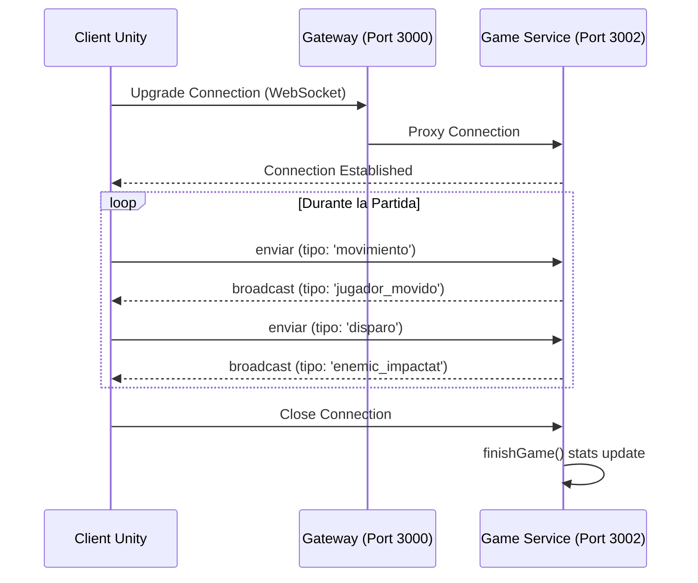
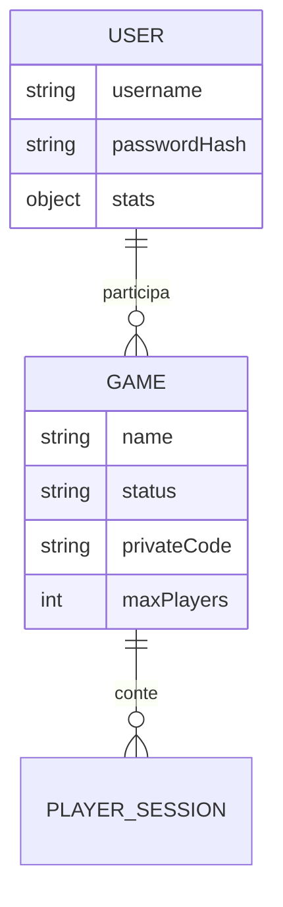
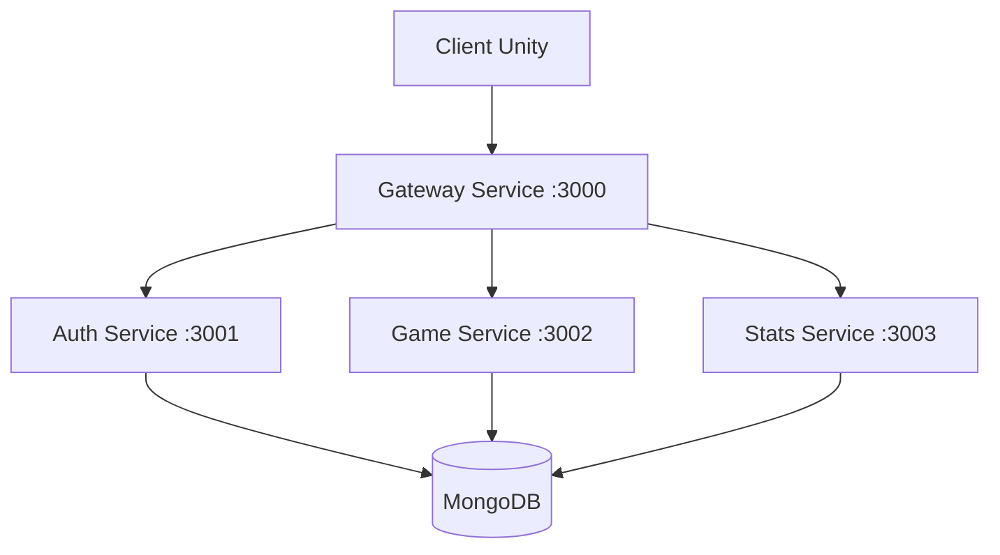

# 📊 Diagrames del Sistema - Arena Bots

Aquests diagrames detallen el funcionament intern i l'arquitectura del projecte.

## 1. Casos d'Ús
Representa les interaccions principals de l'usuari amb el sistema.

```mermaid
useCaseDiagram
    actor Usuari
    Usuari --> (Registrar-se / Login)
    Usuari --> (Crear / Unir-se a Partida)
    Usuari --> (Jugar Partida PvE)
    Usuari --> (Sincronitzar Moviment i Trets)
    Usuari --> (Veure Estadístiques)
```

## 2. Seqüència: Procés de Joc (WebSocket)
Mostra com flueix la informació en temps real durant una partida multijugador.



## 3. Entitat-Relació (Model de Dades)
Estructura de dades emmagatzemada a MongoDB.



## 4. Arquitectura de Microserveis
Disseny de la infraestructura distribuïda.


